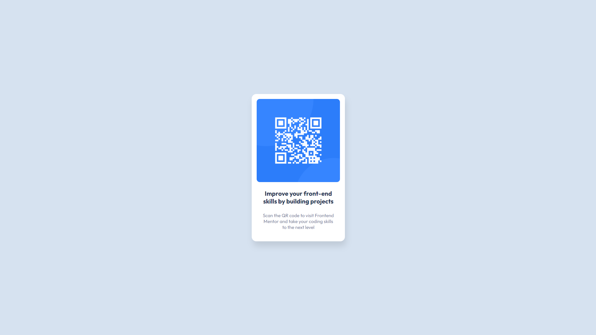

# Frontend Mentor - QR code component solution

This is a solution to the [QR code component challenge on Frontend Mentor](https://www.frontendmentor.io/challenges/qr-code-component-iux_sIO_H). Frontend Mentor challenges help you improve your coding skills by building realistic projects. 

## Overview

Creation of a QR code component using only HTML and CSS.

### Screenshot

## My process

First, I read the available documentation to understand what needed to be done and what the requirements were in the style guide, and organized all the files I had to work with. Then, I structured the HTML, already adding the classes that I would use. After that, I applied a reset of some styles in CSS and applied the styles to the necessary elements to get as close as possible to the reference design.

### Built with

- CSS custom properties
- Flexbox

### What I learned

This project helped me practice Flexbox concepts, and mainly through this readme, it helped me develop process documentation - something that I still have difficulties executing.

### Continued development

I seek to continue my development in the front-end area, practicing HTML and CSS concepts, and some JavaScript things, as well as learning how to better structure my files and document my processes. This is the first of many projects that I intend to undertake to become a front-end developer.